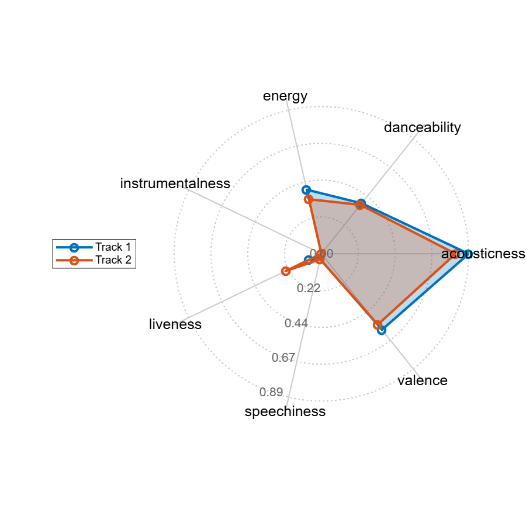

# K\-NN explained

Explain K\-Nearest Neighbors to recommend music

<a name="beginToc"></a>

## Table of Contents
&emsp;&emsp;[Setup](#setup)
 
&emsp;&emsp;[Search track](#search-track)
 
&emsp;&emsp;[Audio Features](#audio-features)
 
&emsp;&emsp;[Recommendation](#recommendation)
 
&emsp;&emsp;[Utils](#utils)
 
<a name="endToc"></a>

## Setup

Install Spotipy

```matlab
setup_python
```

Get secrets from [developer.spotify.com](https://developer.spotify.com/) and store in `.env` file.

```matlab
loadenv(".env")
sp = createSpotifyClient(getenv("clientId"),getenv("clientSecret"));
```

## Search track
```matlab
query = "times there are a changin ";
% query = "lucy in the sky with diamonds";
T = searchTrack(sp,query)
```
| |track_id|track_name|artist_name|album_name|album_url|
|:--:|:--:|:--:|:--:|:--:|:--:|
|1|"0HaSK4Tw1IHqvyoYJTqoYz"|"Seize the Night"|"Will Varley"|"Postcards from Ursa Minor"|"https://i.scdn.co/image/ab67616d00001e02e687b505e69d3937acadd092"|
|2|"52vA3CYKZqZVdQnzRrdZt6"|"The Times They Are A-Changin'"|"Bob Dylan"|"The Times They Are A-Changin'"|"https://i.scdn.co/image/ab67616d00001e023b812eed53f0d7e134fe446e"|
|3|"0XLErri8gfXecR6NWR71bY"|"Talking New Bob Dylan"|"Loudon Wainwright III"|"History"|"https://i.scdn.co/image/ab67616d00001e028fc36d961982558394df9257"|
|4|"2ekvSQupVG7X88fjjdYScf"|"Times Are Changing"|"Astrality"|"Times Are Changing"|"https://i.scdn.co/image/ab67616d00001e02309cdb3f797f58db6e0465b2"|
|5|"0GONea6G2XdnHWjNZd6zt3"|"Summer Of '69"|"Bryan Adams"|"Reckless (30th Anniversary / Deluxe Edition)"|"https://i.scdn.co/image/ab67616d00001e02cf1fee2a55e98e22bf358512"|
|6|"0IvdJ0V3Sl6ClrmJLrGEUV"|"The Times They Are a-Changin' - Live at Madison Square Garden, New York, NY - October 1992"|"Tracy Chapman"|"Bob Dylan - 30th Anniversary Concert Celebration [(Deluxe Edition) [Remastered]]"|"https://i.scdn.co/image/ab67616d00001e0283d8116743c8b818a18666c5"|
|7|"7t6RtYgqSMb0uQH4PpPHCn"|"Let Me Get By"|"Tedeschi Trucks Band"|"Let Me Get By (Deluxe Edition)"|"https://i.scdn.co/image/ab67616d00001e023d9f33eba9a843cca32e80d1"|
|8|"1asEw2nftED92wW9t6q2ao"|"Times Have Changed"|"Ronnie Baker Brooks"|"Times Have Changed"|"https://i.scdn.co/image/ab67616d00001e024608e0aac6801f959c243340"|
|9|"4yGS6Y7ygZJ4l5wnVfbPwz"|"Let Me Get By"|"Tedeschi Trucks Band"|"Let Me Get By"|"https://i.scdn.co/image/ab67616d00001e021ee769ec169b3dd47257d671"|
|10|"4fYeRpiNyejUfkgskbhqmz"|"The Times They Are a-Changin (Campaign Zero)"|"Goth Babe"|"The Times They Are a-Changin (Campaign Zero)"|"https://i.scdn.co/image/ab67616d00001e022b86118a6322dd163546fb70"|

```matlab
max_v = height(T);
```

```matlab
v = 2;
result =  T(v,:);
imshow(imread(result.album_url))
```


## Audio Features
```matlab
track_features = getFeatures(sp,result.track_id)
```

```matlabTextOutput
track_features = struct with fields:
        acousticness: 0.8870
        danceability: 0.3890
              energy: 0.3960
    instrumentalness: 0
            liveness: 0.0828
         speechiness: 0.0332
             valence: 0.5850

```

```matlab
if true
    plotFeatures(track_features)
end
```


## Recommendation
```matlab
% index playlist as source of recommendations
playlist = readtable("music/data/streaming_history.csv","TextType","string");
playlistIds = playlist.id;
features = table2array(playlist(:,{'acousticness','danceability','energy','instrumentalness','liveness','speechiness','valence'}));
knnModel = createns(features,'Distance','cosine');
% default seeding with first element of the playlist
% playlist{1,"name"}
% features(1,:)
k = 5;
[indices, ~] = knnsearch(knnModel, struct2array(track_features), 'K', k);
recoIds = playlistIds(indices);
playlist(indices,"name")
```
| |name|
|:--:|:--:|
|1|"The Times They Are A-Changin'"|
|2|"La bohème"|
|3|"Angie"|
|4|"Take Five"|
|5|"The Wind"|

```matlab
r = 2;
dispTrackDetails(sp,recoIds(r))
```

```matlabTextOutput
Track: La bohème
Album: La Bohème (Remastered 2014)
Artist: Charles Aznavour
URL: https://open.spotify.com/track/2o0hVSbnkdvDDKKVNaUxnB
```


```matlab
recoFeatures = [struct2table(track_features);playlist(indices(r),{'acousticness','danceability','energy','instrumentalness','liveness','speechiness','valence'})];
plotMultipleFeatures(recoFeatures)
```



## Utils
```matlab
function sp = createSpotifyClient(clientId,clientSecret)
    spotipy = py.importlib.import_module('spotipy');
    auth_manager = spotipy.oauth2.SpotifyClientCredentials(client_id=clientId, client_secret=clientSecret);
    sp = spotipy.Spotify(auth_manager = auth_manager);
end

function result = searchTrack1(sp,query)
    res = sp.search(q="track: "+ query, type = "track");
    items = res{'tracks'}{'items'};
    result.track_id = string(items{1}{'id'});
    result.track_name = string(items{1}{'name'});
    result.track_artist = string(items{1}{'artists'}{1}{'name'});
    result.track_album = string(items{1}{'album'}{'name'});
end

function T = searchTrack(sp, query)
res = sp.search(q="track: "+ query, type = "track");
items = res{'tracks'}{'items'};
result = pyrun("track_results = [{" + ...
    "'track_id': item['id']," + ...
    "'track_name': item['name']," + ...
    "'artist_name': item['artists'][0]['name']," + ...
    "'album_name': item['album']['name']," + ...
    "'album_url': item['album']['images'][1]['url']}" + ...
    "for item in items]", "track_results",items=items);
T = table(py.pandas.DataFrame(result));
end

function track_features = getFeatures(sp,track_id)
    track_features = sp.audio_features(track_id);
    track_features = struct(track_features{1});
    labels = {'acousticness','danceability','energy','instrumentalness','liveness','speechiness','valence'};
    allFields = fieldnames(track_features);
    toRemove  = setdiff(allFields, labels);
    track_features = rmfield(track_features, toRemove);
    track_features = orderfields(track_features);
    % loop over each field and cast to double
    for k = 1:numel(labels)
        track_features.(labels{k}) = double(track_features.(labels{k}));
    end
end

function plotFeatures(track_features)
    % --- Given struct of track features ------------------------------------
    % track_features = struct( ...
    %    'danceability',    0.5170, ...
    %    'energy',          0.5060, ...
    %    'loudness',       -10.9180, ...
    %    'speechiness',     0.0311, ...
    %    'acousticness',    0.4310, ...
    %    'instrumentalness',9.6000e-04, ...
    %    'liveness',        0.9660, ...
    %    'valence',         0.4570);
    
    % 1) Extract labels & values
    labels = fieldnames(track_features);
    stats  = cell2mat(struct2cell(track_features))';   % row vector
    
    % 2) Close the loop
    nVars = numel(stats);
    theta = linspace(0,2*pi,nVars+1);   % includes endpoint 2π
    rho   = [stats, stats(1)];          % append first stat at end
    
    % 3) Convert to Cartesian
    [x, y] = pol2cart(theta, rho);
    
    % --- Build the plot -----------------------------------------------------
    figure('Position',[100 100 600 600]);
    hold on;
    axis equal off;
    
    % 4) Draw radial grid circles
    rTicks = [0.2 0.4 0.6 0.8];
    tGrid  = linspace(0,2*pi,200);
    for r = rTicks
        plot(r*cos(tGrid), r*sin(tGrid), ':', 'LineWidth', 1, 'Color', [0.8 0.8 0.8]);
    end
    
    % 5) Draw spokes
    for k = 1:nVars
        th = theta(k);
        plot([0 cos(th)], [0 sin(th)], '-', 'LineWidth', 1, 'Color', [0.8 0.8 0.8]);
    end
    
    % 6) Fill area & outline
    fill(x, y, 0.5*[1 1 1], 'FaceAlpha', 0.25, 'EdgeColor', 'none');
    plot(x, y, '-o', 'LineWidth', 2, 'Color', 0.5*[1 1 1]);
    
    % 7) Feature labels around the outside
    labelRadius = 1;  % just outside the unit circle
    for k = 1:nVars
        th = theta(k);
        text(labelRadius*cos(th), labelRadius*sin(th), labels{k}, ...
             'FontSize', 12, 'HorizontalAlignment', 'center');
    end
    
    % 8) Radial-tick labels at ~250°
    labelAngle = deg2rad(250);
    for r = rTicks
        text(r*cos(labelAngle), r*sin(labelAngle), sprintf('%.1f', r), ...
             'FontSize', 12, 'Color', [0.4 0.4 0.4], ...
             'HorizontalAlignment','center');
    end
    
    % title('Track Feature Radar Chart');
    hold off;
end

function plotMultipleFeatures(trackFeatures)
    % PLOTMULTIPLEFEATURES   Radar chart of track features for multiple tracks.
    %
    %   plotMultipleFeatures(trackFeatures) draws a radar chart where each row of
    %   the input table trackFeatures is one “track” and each variable (column)
    %   is a feature (assumed on a comparable scale, e.g. 0–1).
    %
    %   The table may optionally have RowNames, which will be used in the legend.
    %
    % Example:
    %   % construct a table of two tracks and seven features
    %   T = array2table([0.5 0.6 0.3 0.2 0.7 0.1 0.9;
    %                    0.8 0.4 0.5 0.3 0.6 0.2 0.4], ...
    %       'VariableNames',{'danceability','energy','speechiness', ...
    %                        'acousticness','instrumentalness','liveness','valence'}, ...
    %       'RowNames',{'TrackA','TrackB'});
    %   plotMultipleFeatures(T);

    % 1) Extract data
    [nTracks, nVars] = size(trackFeatures);
    labels = trackFeatures.Properties.VariableNames;
    stats  = table2array(trackFeatures);      % nTracks x nVars

    % 2) Angle for each axis (close the loop by repeating the first angle at end)
    theta = linspace(0, 2*pi, nVars+1);

    % 3) Prepare figure
    figure('Position',[100 100 600 600]);
    hold on;
    axis equal off;

    % 4) Draw radial grid
    maxR   = max(stats(:));
    rTicks = linspace(0, maxR, 5);          % e.g. 5 rings
    tGrid  = linspace(0,2*pi,200);
    for r = rTicks
        plot(r*cos(tGrid), r*sin(tGrid), ':','LineWidth',1,'Color',[0.8 0.8 0.8]);
    end

    % 5) Draw spokes
    for k = 1:nVars
        th = theta(k);
        plot([0 cos(th)], [0 sin(th)], '-','LineWidth',1,'Color',[0.8 0.8 0.8]);
    end

    % 6) Plot each track
    colors = lines(nTracks);    % distinct colors
    if ~isempty(trackFeatures.Properties.RowNames)
        legendNames = trackFeatures.Properties.RowNames;
    else
        legendNames = arrayfun(@(i) sprintf('Track %d',i),1:nTracks,'Uni',false);
    end

    hLines = gobjects(nTracks,1);
    for i = 1:nTracks
        rho = [stats(i,:), stats(i,1)];          % close loop
        [x, y] = pol2cart(theta, rho);
        fill(x, y, colors(i,:), 'FaceAlpha',0.25, 'EdgeColor','none');
        plot(x, y, '-o', 'LineWidth',2, 'Color',colors(i,:));
        % draw line + markers, set DisplayName for legend
        hLines(i) = plot(x,y,'-o','LineWidth',2, ...
                         'Color',colors(i,:), ...
                         'DisplayName',legendNames{i});
    end

    % 7) Feature labels just outside the outermost ring
    labelR = maxR * 1.1;
    for k = 1:nVars
        th = theta(k);
        text(labelR*cos(th), labelR*sin(th), labels{k}, ...
             'FontSize',12, 'HorizontalAlignment','center');
    end

    % 8) Radial tick labels (at a fixed angle)
    labelAngle = deg2rad(250);
    for r = rTicks
        text(r*cos(labelAngle), r*sin(labelAngle), sprintf('%.2f', r), ...
             'FontSize',10, 'Color',[0.4 0.4 0.4], ...
             'HorizontalAlignment','center');
    end

    % 9) Add legend
    legend(hLines, 'Location','westoutside');
    hold off;
end

function dispTrackDetails(sp,track_id)
    track = sp.track(track_id);
    disp("Track: "+string(track{'name'}))
    disp("Album: "+string(track{'album'}{'name'}))
    disp("Artist: "+string(track{'artists'}{1}{'name'}))
    disp("URL: "+string(track{'external_urls'}{'spotify'}))
    imshow(imread(string(track{'album'}{'images'}{2}{'url'})))
end

```

```matlab
export livescript.mlx README.md;
```

```matlabTextOutput
Index exceeds array bounds.

Error in latex2markdown (line 229)
    markdown = latexTabular2Markdown(markdown, alignments{k}, tabulars{k}, options);

Error in convertLaTeX2Markdown (line 99)
mdText = latex2markdown(texText, texFilename, options{:});

Error in matlab.desktop.editor.export.MarkdownExporter/export (line 53)
            result = convertLaTeX2Markdown(newOptions);

Error in matlab.desktop.editor.internal.exportDocumentByID (line 89)
  result = exporter.export(editorID, options);

Error in export (line 148)
outputAbsoluteFilename = matlab.desktop.editor.internal.exportDocumentByID(id, options{:});
```
