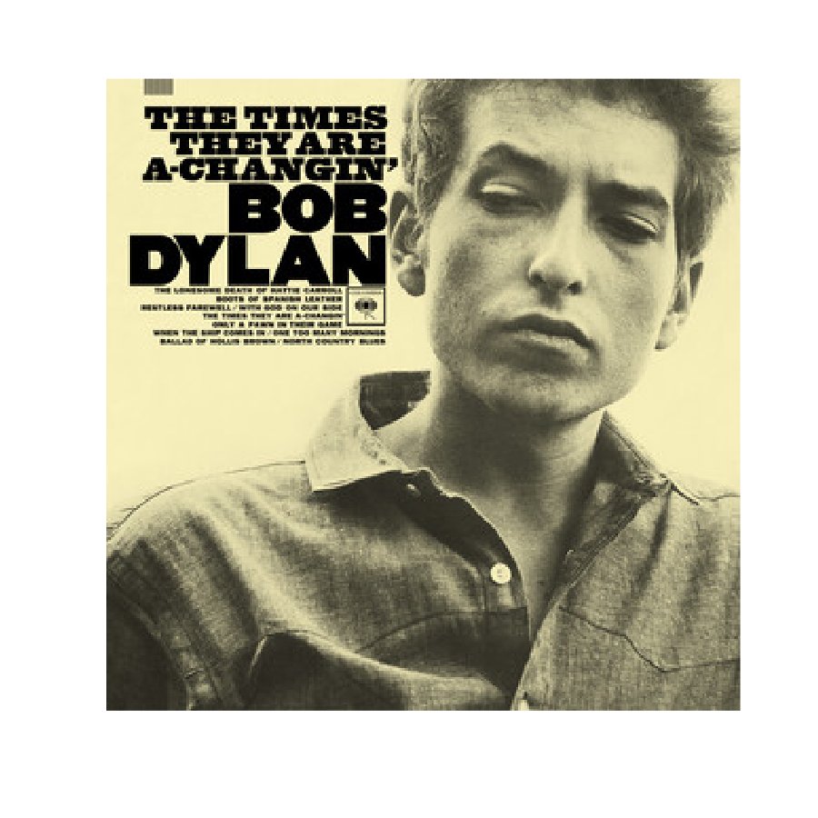
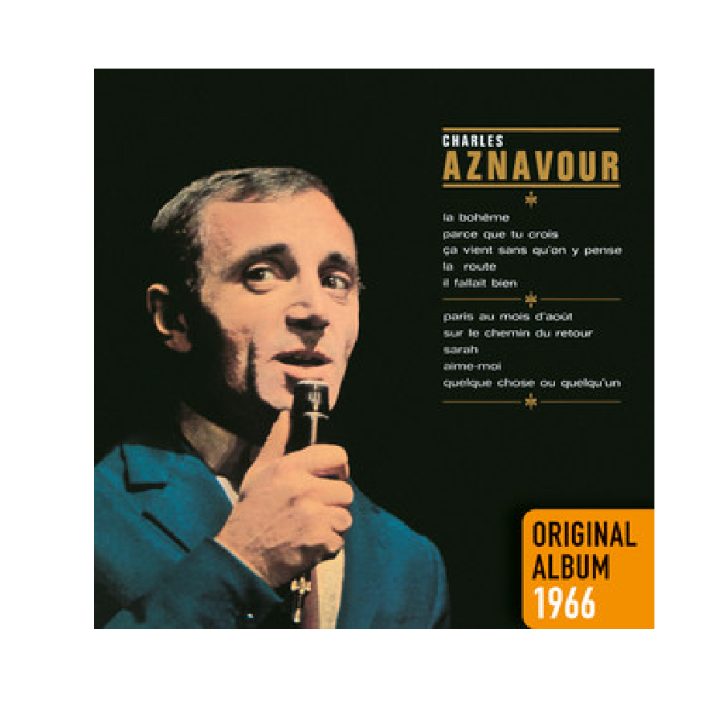

# K\-NN explained

Explain K\-Nearest Neighbors to recommend music

<a name="beginToc"></a>

## Table of Contents
&emsp;&emsp;[Setup](#setup)
 
&emsp;&emsp;[Search track](#search-track)
 
&emsp;&emsp;[Audio Features](#audio-features)
 
&emsp;&emsp;[Recommendation](#recommendation)
 
&emsp;&emsp;[Helpers](#helpers)
 
&emsp;&emsp;[Bonus](#bonus)
 
<a name="endToc"></a>

## Setup

Install Spotipy

```matlab
setup_python
```

Get secrets from [developer.spotify.com](https://developer.spotify.com/) and store in `.env` file.

```matlab
loadenv(".env")
sp = createSpotifyClient(getenv("clientId"),getenv("clientSecret"));
```

## Search track
```matlab
query = "times there are a changin";
% query = "lucy in the sky with diamonds";
T = searchTrack(sp,query)
```
| |track_id|track_name|artist_name|album_name|album_url|
|:--:|:--:|:--:|:--:|:--:|:--:|
|1|"0HaSK4Tw1IHqvyoYJTqoYz"|"Seize the Night"|"Will Varley"|"Postcards from Ursa Minor"|"https://i.scdn.co/image/ab67616d00001e02e687b505e69d3937acadd092"|
|2|"52vA3CYKZqZVdQnzRrdZt6"|"The Times They Are A-Changin'"|"Bob Dylan"|"The Times They Are A-Changin'"|"https://i.scdn.co/image/ab67616d00001e023b812eed53f0d7e134fe446e"|
|3|"7l6rV93uTA1bYdJISGiwoV"|"Seize the Night - Live from 2000 Trees Festival"|"Will Varley"|"Xtra Mile High Club, Vol. 7: Truckin'"|"https://i.scdn.co/image/ab67616d00001e02a72c067c9fd99dd1dce4b2a4"|
|4|"2ekvSQupVG7X88fjjdYScf"|"Times Are Changing"|"Astrality"|"Times Are Changing"|"https://i.scdn.co/image/ab67616d00001e02309cdb3f797f58db6e0465b2"|
|5|"0XLErri8gfXecR6NWR71bY"|"Talking New Bob Dylan"|"Loudon Wainwright III"|"History"|"https://i.scdn.co/image/ab67616d00001e028fc36d961982558394df9257"|
|6|"0IvdJ0V3Sl6ClrmJLrGEUV"|"The Times They Are a-Changin' - Live at Madison Square Garden, New York, NY - October 1992"|"Tracy Chapman"|"Bob Dylan - 30th Anniversary Concert Celebration [(Deluxe Edition) [Remastered]]"|"https://i.scdn.co/image/ab67616d00001e0283d8116743c8b818a18666c5"|
|7|"0GONea6G2XdnHWjNZd6zt3"|"Summer Of '69"|"Bryan Adams"|"Reckless (30th Anniversary / Deluxe Edition)"|"https://i.scdn.co/image/ab67616d00001e02cf1fee2a55e98e22bf358512"|
|8|"4fYeRpiNyejUfkgskbhqmz"|"The Times They Are a-Changin (Campaign Zero)"|"Goth Babe"|"The Times They Are a-Changin (Campaign Zero)"|"https://i.scdn.co/image/ab67616d00001e022b86118a6322dd163546fb70"|
|9|"7t6RtYgqSMb0uQH4PpPHCn"|"Let Me Get By"|"Tedeschi Trucks Band"|"Let Me Get By (Deluxe Edition)"|"https://i.scdn.co/image/ab67616d00001e023d9f33eba9a843cca32e80d1"|
|10|"1YJHxl53keKuB8QywSlFhb"|"Changin'"|"Brass Construction"|"Brass Construction"|"https://i.scdn.co/image/ab67616d00001e02428317f80a438d617f31b22a"|

```matlab
max_v = height(T);
 
```

```matlab
v = 2;
result =  T(v,:);
imshow(imread(result.album_url))
```



## Audio Features
```matlab
track_features = getFeatures(sp,result.track_id)
```

```matlabTextOutput
track_features = struct with fields:
        acousticness: 0.8870
        danceability: 0.3890
              energy: 0.3960
    instrumentalness: 0
            liveness: 0.0828
         speechiness: 0.0332
             valence: 0.5850

```

```matlab
if false
    plotFeatures(track_features)
end
```

## Recommendation
```matlab
% index playlist as source of recommendations
playlist = readtable("todaysTopHits.csv","TextType","string");
playlistIds = playlist.id;
features = table2array(playlist(:,{'acousticness','danceability','energy','instrumentalness','liveness','speechiness','valence'}));
knnModel = createns(features,'Distance','cosine');
% default seeding with first element of playlist{1,"name"} / features(1,:)
k = 6;
[indices, ~] = knnsearch(knnModel, struct2array(track_features), 'K', k);
recoIds = playlistIds(indices);
playlist(indices,"name")
```
| |name|
|:--:|:--:|
|1|"blue"|
|2|"Sailor Song"|
|3|"Ordinary"|
|4|"What I Want (feat. Tate McRae)"|
|5|"No One Noticed"|
|6|"WILDFLOWER"|

```matlab
r = 1;
dispTrackDetails(sp,recoIds(r))
```

```matlabTextOutput
Track: blue
Album: blue
Artist: yung kai
URL: https://open.spotify.com/track/3be9ACTxtcL6Zm4vJRUiPG
```


```matlab
recoFeatures = [struct2table(track_features);playlist(indices(r),{'acousticness','danceability','energy','instrumentalness','liveness','speechiness','valence'})];
plotMultipleFeatures(recoFeatures)
```



## Helpers

Feature definitions:

-  **acousticness**: Confidence measure from 0.0 to 1.0 on if a track is acoustic. 
-  **danceability**: Danceability describes how suitable a track is for dancing based on a combination of musical elements including tempo, rhythm stability, beat strength, and overall regularity. A value of 0.0 is least danceable and 1.0 is most danceable. 
-  **energy**: Energy is a measure from 0.0 to 1.0 and represents a perceptual measure of intensity and activity. Typically, energetic tracks feel fast, loud, and noisy. For example, death metal has high energy, while a Bach prelude scores low on the scale. Perceptual features contributing to this attribute include dynamic range, perceived loudness, timbre, onset rate, and general entropy. 
-  **instrumentalness**: Predicts whether a track contains no vocals. “Ooh” and “aah” sounds are treated as instrumental in this context. Rap or spoken word tracks are clearly “vocal”. The closer the instrumentalness value is to 1.0, the greater likelihood the track contains no vocal content. Values above 0.5 are intended to represent instrumental tracks, but confidence is higher as the value approaches 1.0. 
-  **liveness**: Detects the presence of an audience in the recording. Higher liveness values represent an increased probability that the track was performed live. A value above 0.8 provides strong likelihood that the track is live. 
-  **speechiness**: Speechiness detects the presence of spoken words in a track. The more exclusively speech\-like the recording (e.g. talk show, audio book, poetry), the closer to 1.0 the attribute value. Values above 0.66 describe tracks that are probably made entirely of spoken words. Values between 0.33 and 0.66 describe tracks that may contain both music and speech, either in sections or layered, including such cases as rap music. Values below 0.33 most likely represent music and other non\-speech\-like tracks. 
-  **valence**: A measure from 0.0 to 1.0 describing the musical positiveness conveyed by a track. Tracks with high valence sound more positive (e.g. happy, cheerful, euphoric), while tracks with low valence sound more negative (e.g. sad, depressed, angry). 

"Show must go on"

```matlab
function sp = createSpotifyClient(clientId,clientSecret)
    spotipy = py.importlib.import_module('spotipy');
    auth_manager = spotipy.oauth2.SpotifyClientCredentials(client_id=clientId, client_secret=clientSecret);
    sp = spotipy.Spotify(auth_manager = auth_manager);
end

function result = searchTrack1(sp,query)
    res = sp.search(q="track: "+ query, type = "track");
    items = res{'tracks'}{'items'};
    result.track_id = string(items{1}{'id'});
    result.track_name = string(items{1}{'name'});
    result.track_artist = string(items{1}{'artists'}{1}{'name'});
    result.track_album = string(items{1}{'album'}{'name'});
end

function T = searchTrack(sp, query)
res = sp.search(q="track: "+ query, type = "track");
items = res{'tracks'}{'items'};
result = pyrun("track_results = [{" + ...
    "'track_id': item['id']," + ...
    "'track_name': item['name']," + ...
    "'artist_name': item['artists'][0]['name']," + ...
    "'album_name': item['album']['name']," + ...
    "'album_url': item['album']['images'][1]['url']}" + ...
    "for item in items]", "track_results",items=items);
T = table(py.pandas.DataFrame(result));
end

function track_features = getFeatures(sp,track_id)
    track_features = sp.audio_features(track_id);
    track_features = struct(track_features{1});
    labels = {'acousticness','danceability','energy','instrumentalness','liveness','speechiness','valence'};
    allFields = fieldnames(track_features);
    toRemove  = setdiff(allFields, labels);
    track_features = rmfield(track_features, toRemove);
    track_features = orderfields(track_features);
    % loop over each field and cast to double
    for k = 1:numel(labels)
        track_features.(labels{k}) = double(track_features.(labels{k}));
    end
end

function plotFeatures(track_features)
    % --- Given struct of track features ------------------------------------
    % track_features = struct( ...
    %    'danceability',    0.5170, ...
    %    'energy',          0.5060, ...
    %    'loudness',       -10.9180, ...
    %    'speechiness',     0.0311, ...
    %    'acousticness',    0.4310, ...
    %    'instrumentalness',9.6000e-04, ...
    %    'liveness',        0.9660, ...
    %    'valence',         0.4570);
    
    % 1) Extract labels & values
    labels = fieldnames(track_features);
    stats  = cell2mat(struct2cell(track_features))';   % row vector
    
    % 2) Close the loop
    nVars = numel(stats);
    theta = linspace(0,2*pi,nVars+1);   % includes endpoint 2π
    rho   = [stats, stats(1)];          % append first stat at end
    
    % 3) Convert to Cartesian
    [x, y] = pol2cart(theta, rho);
    
    % --- Build the plot -----------------------------------------------------
    figure('Position',[100 100 600 600]);
    hold on;
    axis equal off;
    
    % 4) Draw radial grid circles
    rTicks = [0.2 0.4 0.6 0.8];
    tGrid  = linspace(0,2*pi,200);
    for r = rTicks
        plot(r*cos(tGrid), r*sin(tGrid), ':', 'LineWidth', 1, 'Color', [0.8 0.8 0.8]);
    end
    
    % 5) Draw spokes
    for k = 1:nVars
        th = theta(k);
        plot([0 cos(th)], [0 sin(th)], '-', 'LineWidth', 1, 'Color', [0.8 0.8 0.8]);
    end
    
    % 6) Fill area & outline
    fill(x, y, 0.5*[1 1 1], 'FaceAlpha', 0.25, 'EdgeColor', 'none');
    plot(x, y, '-o', 'LineWidth', 2, 'Color', 0.5*[1 1 1]);
    
    % 7) Feature labels around the outside
    labelRadius = 1;  % just outside the unit circle
    for k = 1:nVars
        th = theta(k);
        text(labelRadius*cos(th), labelRadius*sin(th), labels{k}, ...
             'FontSize', 12, 'HorizontalAlignment', 'center');
    end
    
    % 8) Radial-tick labels at ~250°
    labelAngle = deg2rad(250);
    for r = rTicks
        text(r*cos(labelAngle), r*sin(labelAngle), sprintf('%.1f', r), ...
             'FontSize', 12, 'Color', [0.4 0.4 0.4], ...
             'HorizontalAlignment','center');
    end
    
    % title('Track Feature Radar Chart');
    hold off;
end

function plotMultipleFeatures(trackFeatures)
    % PLOTMULTIPLEFEATURES   Radar chart of track features for multiple tracks.
    %
    %   plotMultipleFeatures(trackFeatures) draws a radar chart where each row of
    %   the input table trackFeatures is one “track” and each variable (column)
    %   is a feature (assumed on a comparable scale, e.g. 0–1).
    %
    %   The table may optionally have RowNames, which will be used in the legend.
    %
    % Example:
    %   % construct a table of two tracks and seven features
    %   T = array2table([0.5 0.6 0.3 0.2 0.7 0.1 0.9;
    %                    0.8 0.4 0.5 0.3 0.6 0.2 0.4], ...
    %       'VariableNames',{'danceability','energy','speechiness', ...
    %                        'acousticness','instrumentalness','liveness','valence'}, ...
    %       'RowNames',{'TrackA','TrackB'});
    %   plotMultipleFeatures(T);

    % 1) Extract data
    [nTracks, nVars] = size(trackFeatures);
    labels = trackFeatures.Properties.VariableNames;
    stats  = table2array(trackFeatures);      % nTracks x nVars

    % 2) Angle for each axis (close the loop by repeating the first angle at end)
    theta = linspace(0, 2*pi, nVars+1);

    % 3) Prepare figure
    figure('Position',[100 100 600 600]);
    hold on;
    axis equal off;

    % 4) Draw radial grid
    maxR   = max(stats(:));
    rTicks = linspace(0, maxR, 5);          % e.g. 5 rings
    tGrid  = linspace(0,2*pi,200);
    for r = rTicks
        plot(r*cos(tGrid), r*sin(tGrid), ':','LineWidth',1,'Color',[0.8 0.8 0.8]);
    end

    % 5) Draw spokes
    for k = 1:nVars
        th = theta(k);
        plot([0 cos(th)], [0 sin(th)], '-','LineWidth',1,'Color',[0.8 0.8 0.8]);
    end

    % 6) Plot each track
    colors = lines(nTracks);    % distinct colors
    if ~isempty(trackFeatures.Properties.RowNames)
        legendNames = trackFeatures.Properties.RowNames;
    else
        legendNames = arrayfun(@(i) sprintf('Track %d',i),1:nTracks,'Uni',false);
    end

    hLines = gobjects(nTracks,1);
    for i = 1:nTracks
        rho = [stats(i,:), stats(i,1)];          % close loop
        [x, y] = pol2cart(theta, rho);
        fill(x, y, colors(i,:), 'FaceAlpha',0.25, 'EdgeColor','none');
        plot(x, y, '-o', 'LineWidth',2, 'Color',colors(i,:));
        % draw line + markers, set DisplayName for legend
        hLines(i) = plot(x,y,'-o','LineWidth',2, ...
                         'Color',colors(i,:), ...
                         'DisplayName',legendNames{i});
    end

    % 7) Feature labels just outside the outermost ring
    labelR = maxR * 1.1;
    for k = 1:nVars
        th = theta(k);
        text(labelR*cos(th), labelR*sin(th), labels{k}, ...
             'FontSize',12, 'HorizontalAlignment','center');
    end

    % 8) Radial tick labels (at a fixed angle)
    labelAngle = deg2rad(250);
    for r = rTicks
        text(r*cos(labelAngle), r*sin(labelAngle), sprintf('%.2f', r), ...
             'FontSize',10, 'Color',[0.4 0.4 0.4], ...
             'HorizontalAlignment','center');
    end

    % 9) Add legend
    legend(hLines, 'Location','westoutside');
    hold off;
end

function dispTrackDetails(sp,track_id)
    track = sp.track(track_id);
    disp("Track: "+string(track{'name'}))
    disp("Album: "+string(track{'album'}{'name'}))
    disp("Artist: "+string(track{'artists'}{1}{'name'}))
    disp("URL: "+string(track{'external_urls'}{'spotify'}))
    imshow(imread(string(track{'album'}{'images'}{2}{'url'})))
end

function track_ids = fetchPlaylistTracks(sp, playlist_id)
    % FETCHPLAYLISTTRACKS gets the content of a Spotify Playlist
    % playlist_id = "37i9dQZF1DXcBWIGoYBM5M" % Today's Top Hits
    % TRACK_IDS = FETCHPLAYLISTTRACKS(SP, PLAYLIST_ID) returns a list of tracks

    % Python code input
    pycode = [...
    "import spotipy",...
    "from typing import List",...
    "def fetch_playlist_tracks(sp: spotipy.Spotify, playlist_id: str) -> List[str]:",...
    "    """"""Return every track ID inside a playlist (handles pagination).""""""",...
    "    track_ids = []",...
    "    results = sp.playlist_items(playlist_id, additional_types=[""track""], limit=100)",...
    "    track_ids.extend([",...
    "        item[""track""][""id""]",...
    "        for item in results[""items""]",...
    "        if item.get(""track"") and item[""track""].get(""id"")",...
    "    ])",...
    "    while results[""next""]:",...
    "        results = sp.next(results)",...
    "        track_ids.extend([",...
    "            item[""track""][""id""]",...
    "            for item in results[""items""]",...
    "            if item.get(""track"") and item[""track""].get(""id"")",...
    "        ])",...
    "    return track_ids",...
    "",...
    "t = fetch_playlist_tracks(sp, playlist_id)"...
    ];
    
    try
        t = pyrun(pycode, "t", "sp", sp, "playlist_id", playlist_id);
    catch ME
        % Clear temporary variables from workspace and from Python
        clear pycode;
        if ME.identifier == "MATLAB:Python:PyException"
            pyrun("del sp, playlist_id");
        end
        rethrow(ME)
    end
    % Clear temporary variables from workspace and from Python
    clear pycode;
    pyrun("del sp, playlist_id");
    track_ids = string(t);
end
```

## Bonus

Get features from spotify playlists

```matlab
% playlist_id = "4ANPW38qMEYQ3Z1mVLrtmm"; % lofi
playlist_id = "37i9dQZF1DXcBWIGoYBM5M"; % Today's Top Hits
track_ids = fetchPlaylistTracks(sp, playlist_id);
F = table();
for tid = track_ids
    F = [F;struct2table(getFeatures(sp,tid))];
end
F.id = track_ids';
tracks = sp.tracks(py.list(cellstr(track_ids))); % works with list up to 50 tracks
% tracks{'tracks'}{1}{'name'}
track_name = pyrun("l = [t['name'] for t in tracks['tracks']]","l","tracks",tracks);
F.name = string(track_name)';
writetable(F,'todaysTopHits.csv')
```

```matlab
export livescript.mlx README.md;
```
